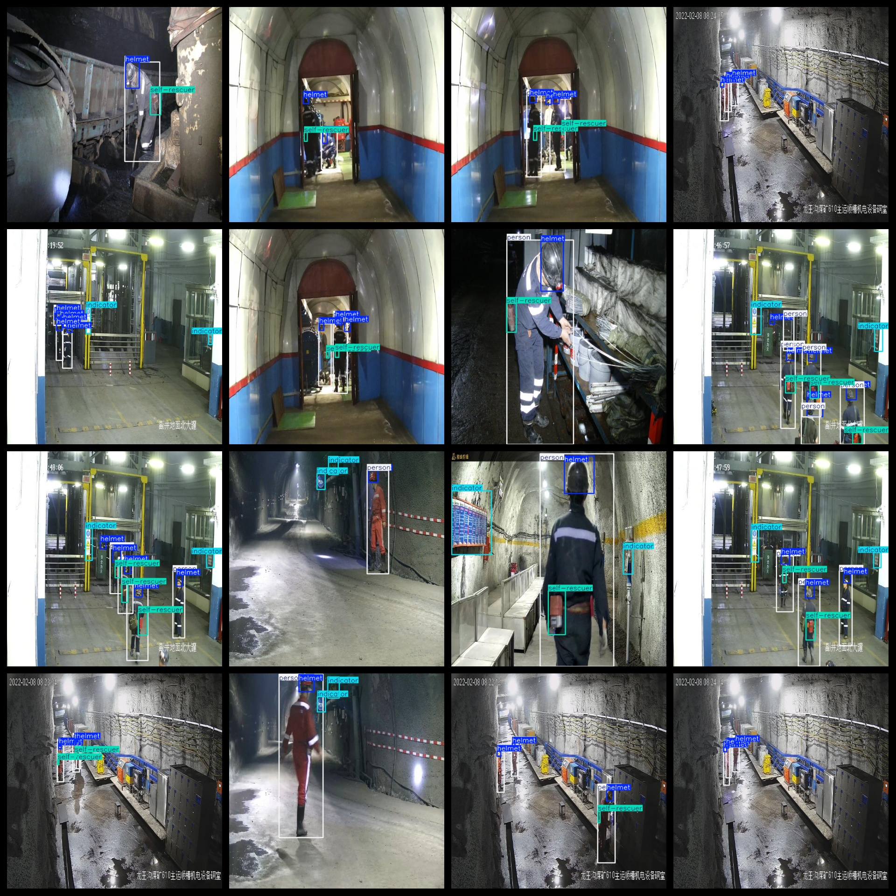
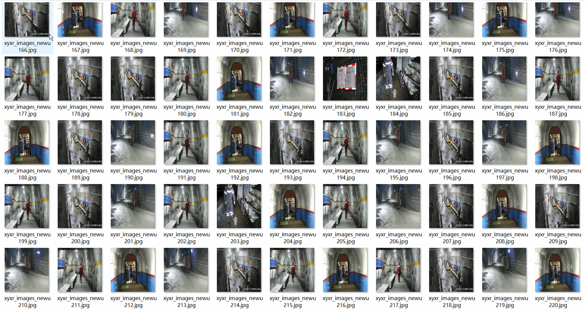

# Mine Underground Target Detection Dataset 4369 imagesVOC+YOLO format

Underground target detection dataset 4369 VOC + YOLO format

Dataset format: Pascal VOC format + YOLO format (the txt file does not contain the split path, it only contains jpg images and corresponding VOC format xml files and yolo format txt files)

Total number of images (number of jpg files): 4369

Number of xml files: 4369

Number of txt files: 4369

Number of annotated categories: 4

The Github repository is: datasets_sl

["helmet", "indicator", "person", "self-rescuer"]

Tag Chinese Translation: Helmet, Light Indicator, Personnel, Self-rescue Device

Number of boxes labeled in each category:

The number of helmets is 10652.

Indicator box number = 6185

The number of persons is 10341.

The number of self-rescuer frames is 4522.

Total frames: 31700

Number of images per category:

Helmets possessing images = 3876

Indicator occupancy of image count = 2451.

Person has 4170 pictures

Self-rescuer's image count = 2940

Image resolution: 640x640

Use the labeling tool: labelImg

Dataset Augmentation: Yes

Rules for annotation: Draw a rectangle around the category.

Important note: The dataset does not have been divided into training, validation, and testing sets.

Special Disclaimer: This dataset does not guarantee the accuracy of the trained models or weight files.

Annotation and image details are as follows:

## Images

---

Here is a pay link on Stripe (https://buy.stripe.com/3cs8yP7sY87d0vu9AB). Please contact me lonlonago@foxmail.com after funding $89, and I will send you a complete data files, thank you!

